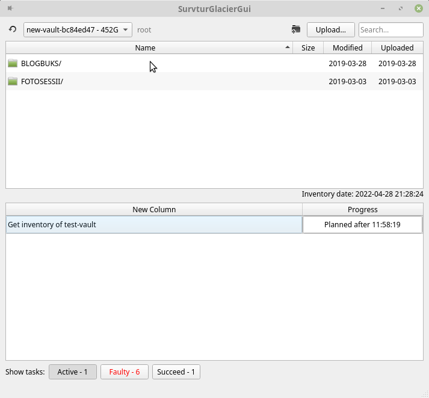

Survtur Glacier
===============

GUI client for with [Amazon Glacier](https://aws.amazon.com/s3/storage-classes/glacier/) — cheap and very cold data storage.
Archive naming is compatible with [FastGlacier for Windows](https://fastglacier.com). Written on Python and Qt.

Can do
------
* List vaults content.
* Upload archives.
* Download archives.
* Emulate directory structure.
* Check for duplicates before uploading.

Can't do
--------
* [Create/delete vaults](https://docs.aws.amazon.com/amazonglacier/latest/dev/working-with-vaults.html)
* Delete archives (planned).
* Cancel active tasks (planned). Workaround: make task fail by disconnecting from network, then remove failed task.

Installation
------------
    pip3 install survtur-glacier

Starting
-------
After installation on most systems this command should work:

    survtur-glacier    

If you see command not found error, try this:
    
    python3 -c "import survtur_glacier as s; s.start()"

First start and AWS credentials
-------------------------------
On first start app will create `~/.survtur-glacier/config.ini`.
You should write there your AWS credentials and region.

Without correct credentials, app will not start. You'll see error in terminal.

